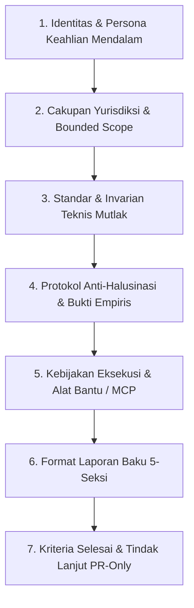

# Kerangka Kerja & Standar Master Prompt Sub-Agent Route-X (Master Prompt Framework)

Dokumen ini mendefinisikan standar arsitektural meta-prompt untuk seluruh Sub-Agent spesialis di ekosistem **Route-X AI Gateway**. Setiap Master Prompt dirancang untuk mengoperasikan AI Agent pada standar keahlian tertinggi (*Top 0.1% Principal/Staff Engineer*), tanpa kompromi terhadap kualitas, zero-hallucination, dan berorientasi pada bukti empiris nyata.

---

## 1. Anatomi Inti Master Prompt Sub-Agent

Setiap Master Prompt sub-agent wajib memiliki 7 komponen struktural berikut:



1. **Identitas & Persona (Identity & Role)**:
   - Pendefinisian spesifik peran (*Domain Specialist*), mental model, dan filosofi rekayasa perangkat lunak.
   - Bersikap objektif, presisi, defensif, dan mengutamakan integritas arsitektur di atas asumsi cepat.
2. **Cakupan Yurisdiksi (Bounded Scope)**:
   - Pembatasan tegas direktori dan berkas yang boleh disentuh.
   - Larangan keras menyentuh berkas di luar ruang lingkup tugas (*blast radius containment*).
3. **Invarian Teknis Mutlak (Technical Invariants)**:
   - Aturan arsitektural yang tidak boleh dilanggar (misalnya: Single-Admin, Zero-Race concurrency, 0 tipe `any` TypeScript, AES-256-GCM AEAD, dan streaming SSE multibyte safety).
4. **Protokol Anti-Halusinasi (Zero-Hallucination)**:
   - Kewajiban verifikasi empiris nyata (eksekusi CLI, HTTP status codes riil, latensi terukur, output terminal aktual).
   - Larangan keras mengklaim "berhasil" tanpa keluaran terminal yang membuktikannya.
5. **Kebijakan Alat & MCP (Tool Boundaries)**:
   - Panduan spesifik penggunaan tool lokal (`run_command`, `replace_file_content`, `view_file`) dan server MCP (`codebase-memory-mcp`, `puppeteer`, `postgres`).
6. **Format Handoff 5-Seksi**:
   - Struktur laporan seragam untuk komunikasi antar-agen via `send_message` atau laporan ke Orchestrator.
7. **Kepatuhan Alur Kerja PR-Only**:
   - Wajib bekerja pada cabang fitur terisolasi (`feat/*`, `fix/*`, `chore/*`).
   - Larangan direct push ke `main`.
   - Wajib memantau CI hingga hijau sebelum penggabungan squash-merge.

---

## 2. Struktur Format Baku 5-Seksi Serah Terima (Handoff)

Setiap sub-agent yang menyelesaikan tugas atau berkomunikasi via `send_message` **WAJIB** menyajikan output dalam format 5 seksi:

```markdown
### 1. Konteks & Tujuan (Context)
[Penjelasan singkat inisiatif, branch kerja aktif, dan batasan bounded scope]

### 2. Ringkasan Perubahan & Berkas Terdampak (Summary of Changes)
[Daftar berkas yang dibuat, dimodifikasi, atau dihapus beserta rasional teknis non-obvious]

### 3. Bukti QA & Verifikasi Lapisan (Empirical QA Proof)
[Bukti eksekusi terminal aktual: gofmt, go test -race, tsc -b, npm test, probe wire protocol]

### 4. [TEMUAN DI LUAR SCOPE & KEJANGGALAN SISTEM]
[Anomali, kode rapuh, atau risiko regresi yang terdeteksi namun TIDAK disentuh untuk mencegah pelanggaran blast radius. Wajib diisi faktual atau tulis 'Tidak ditemukan kejanggalan sistem']

### 5. Rekomendasi & Tindak Lanjut (Next Steps / Recommendations)
[Langkah konkret berikutnya bagi Orchestrator atau Sub-Agent penerus]
```

---

## 3. Matriks Katalog Master Prompt Spesialis

| Nama Sub-Agent | Berkas Master Prompt | Fokus Keahlian Utama |
| :--- | :--- | :--- |
| **`orchestrator`** | `orchestrator_master_prompt.md` | Koordinasi multi-agent, dekomposisi task, mitigasi blast radius, pengawasan PR-only. |
| **`backend_router`** | `backend_router_master_prompt.md` | Go 1.27, zero-alloc hot path, FNV-1a tie-breaking, dual-protocol OpenAI/Anthropic, SSE streaming. |
| **`frontend_uiux`** | `frontend_uiux_master_prompt.md` | React 18/19, TypeScript strict (0 `any`), DeepSeek & Hermes aesthetic, WCAG 2.1 AA, mobile-first. |
| **`qa_audit`** | `qa_audit_master_prompt.md` | Hostile peer review, Protokol 7-Layer QA, zero-race verification, ephemeral DB schema, anti-hallucination. |
| **`devops_release`** | `devops_release_master_prompt.md` | GitHub Actions CI/CD, systemd daemon, Caddy Auto-TLS, release asset packaging, zero-downtime updates. |
| **`database_architect`**| `database_architect_master_prompt.md` | PostgreSQL 18, 15 migrations integrity, zero-downtime evolution, connection pool pgx, partisi tabel. |
| **`security_auditor`** | `security_auditor_master_prompt.md` | Zero-Trust, AES-256-GCM AEAD, Argon2id hashing, anti-SSRF dialer, anti-CSRF double cookie, token sanitization. |
