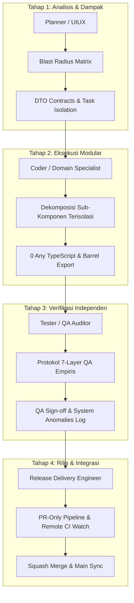

# Aturan Resmi Orkestrasi & Koordinasi Multi-Agent Route-X (multi-agent-orchestration)

Dokumen ini merupakan pedoman tata kelola dan orkestrasi multi-agent resmi untuk ekosistem rekayasa perangkat lunak Route-X. Aturan ini mengikat seluruh AI sub-agent, peer agent, dan orchestrator yang berpartisipasi dalam perancangan, pengembangan, pengujian, audit, dan rilis repositori Route-X.

---

## 1. Filosofi Koordinasi Multi-Agent: Branch Terisolasi, Komunikasi Terkoordinasi

### 1.1. Prinsip Pemisahan Ruang Kerja vs Jalur Komunikasi
Dalam arsitektur orkestrasi Route-X, diberlakukan pemisahan tegas antara **isolasi teknis lingkungan kerja** dan **integrasi komunikasi antar-agen**:
1. **Isolasi Teknis Git Branch (Bounded Workspaces)**:
   - Setiap inisiatif, fitur, refaktor domain, atau audit dikerjakan pada Git branch terpisah (`feat/*`, `fix/*`, `docs/*`, `chore/*`).
   - Tujuannya adalah membatasi *blast radius*, mencegah tabrakan pengeditan berkas (*file locking/race conditions*), menghindari komit parsial yang belum tervalidasi, serta menjamin kebersihan riwayat Git.
2. **Koordinasi Komunikasi Aktif & Berkelanjutan (Unified Collective Intelligence)**:
   - Isolasi branch **BUKAN** berarti agen bekerja secara silo atau terisolasi secara informasi.
   - Jalur komunikasi via pesan terstruktur (`send_message`) **WAJIB** terjalin secara aktif, eksplisit, dan terus-menerus antar-agen (Lead Orchestrator, Sub-Agent Domain, QA Auditor, dan Release Engineer).
   - Sub-agent dilarang mengambil keputusan arsitektural sepihak, menyembunyikan kejanggalan sistem, atau mengasumsikan state agen lain tanpa pertukaran data empiris.

```
+-----------------------------------------------------------------------------------+
|                        ORCHESTRATOR / COLLECTIVE MIND                             |
|       (Sinkronisasi Mental Model, DTO Contracts, Dependency Graph, Review)        |
+---------------------+-------------------------------+-----------------------------+
                      ^                               ^
   send_message (DTO) |            send_message (QA)  |           send_message (PR)
                      v                               v                             v
+---------------------+---------+   +-----------------+---------+   +---------------+---------+
|     Domain Specialist A       |   |       QA Audit Engineer   |   | Release Delivery Eng    |
|   Branch: feat/dashboard      |   |   Branch: audit/verify    |   |   Branch: docs/rules    |
|   (Isolasi Berkas Lokal)      |   |   (Isolasi Verifikasi)    |   |   (Isolasi Pengiriman)  |
+-------------------------------+   +---------------------------+   +-------------------------+
```

---

## 2. Katalog 13 Sub-Agent Resmi Route-X

Repositori Route-X mengklasifikasikan keahlian rekayasa ke dalam 13 sub-agent dengan peran (*Role*), masukan (*Input*), dan keluaran (*Output*) yang terdefinisi secara ketat:

### 2.1. `routex_planner`
- **Peran**: Lead Architectural & Task Planner yang menganalisis kebutuhan inisiatif besar, memetakan graf dependensi antar-modul (Go backend, PostgreSQL migrations, Redis cache, Web Dashboard React), dan menyusun dekomposisi tugas hierarkis berbasis *Blast Radius*.
- **Input**: Dokumen spesifikasi kebutuhan, PRD, isu backlog, analisis Knowledge Graph codebase (`codebase-memory-mcp`), dan batasan arsitektur.
- **Output**: Dokumen Rencana Eksekusi (*Action Plan*), Matriks Blast Radius, Kontrak DTO/Interface awal, dan alokasi penugasan ke sub-agent domain terkait.

### 2.2. `routex_uiux`
- **Peran**: UI/UX Designer & Frontend Architect yang bertanggung jawab atas estetika, ergonomi interaksi pengguna, keselarasan token desain Tailwind CSS/CSS variables, konsistensi tema (*dark/light mode*), serta hierarki navigasi visual konsol Route-X.
- **Input**: Alur pengguna (*user journey*), rancangan antarmuka pengguna, umpan balik audit visual, konfigurasi tema Tailwind (`tailwind.config.js`), dan komponen global.
- **Output**: Spesifikasi komponen antarmuka, standardisasi token warna/tipografi, mockup/wireframe fungsional, dan panduan transisi mikro antarmuka.

### 2.3. `routex_coder`
- **Peran**: Generalist Software Engineer yang menangani penulisan kode umum baik pada tumpukan backend Go (`cmd/`, `internal/`) maupun frontend React TypeScript (`web/src/`), berfokus pada fitur terpadu, utilitas umum, dan perbaikan bug lintas-modul.
- **Input**: Tiket tugas dari `routex_planner`, kontrak DTO, branch kerja terisolasi, dan arsitektur kode eksisting.
- **Output**: Implementasi kode bersih, bebas tipe `any` (100% strict TypeScript), idiomatic Go dengan penanganan error eksplisit, dan unit test dasar.

### 2.4. `routex_tester`
- **Peran**: Automated Test Specialist yang berfokus pada penyusunan dan otomasi test suite komprehensif, mencakup unit test frontend (Vitest), integration test Go (`_test.go`), serta pengujian fungsional komponen web.
- **Input**: Modul implementasi baru/refaktor, spesifikasi skenario pengujian, mock data, dan DSN schema database ephemeral (`test_*`).
- **Output**: Berkas pengujian otomatis (`*.spec.tsx`, `*.spec.ts`, `*_test.go`), laporan cakupan pengujian (*coverage report*), dan pengujian skenario batas (*edge cases*).

### 2.5. `routex_devops`
- **Peran**: Infrastructure, CI/CD, & Observability Specialist yang mengelola konfigurasi build, workflow GitHub Actions, metrik Prometheus (`/metrics`), skrip probe kesehatan sistem, containerization, dan service systemd (`routex.service`).
- **Input**: Alur kerja CI (`.github/workflows/`), skrip operasional (`scripts/`), konfigurasi runtime daemon, dan spesifikasi telemetri.
- **Output**: Pipeline CI/CD yang teroptimasi, skrip otomatisasi diagnostik, konfigurasi alerting & health probe (`/healthz`, `/readyz`), dan audit performa runtime.

### 2.6. `ui_ux_auditor`
- **Peran**: Specialized Frontend Auditor yang melakukan audit mendalam terhadap kepatuhan desain (*design hygiene*), integritas visual, pencegahan regresi UI, kebersihan token tema Tailwind, tata letak responsif (mobile/tablet/desktop), dan aksesibilitas (WCAG).
- **Input**: Berkas komponen web React (`web/src/components/`, `web/src/pages/`), render visual via headless Puppeteer, dan stylesheet tema.
- **Output**: Laporan Audit UI/UX & Aksesibilitas, katalog isu *styling* (hardcoded CSS values, *z-index clashing*, teks terpotong, kontras warna buruk), serta PR perbaikan visual.

### 2.7. `dashboard_refactor_specialist`
- **Peran**: Domain Specialist untuk modernisasi dan modularisasi halaman utama Dashboard (`web/src/pages/Dashboard.tsx`), bertanggung jawab atas agregasi visual telemetri gateway, grafik throughput/latensi, kartu status backend, dan pintasan alur onboarding.
- **Input**: Halaman Dashboard monolitik, endpoint API `/api/telemetry` & `/api/health`, dan spesifikasi token antarmuka.
- **Output**: Sub-komponen modular terisolasi di `web/src/components/dashboard/`, barrel export (`index.ts`), 0 tipe `any`, pemisahan concern state telemetri yang efisien terhadap re-render.

### 2.8. `egress_refactor_specialist`
- **Peran**: Domain Specialist untuk dekomposisi modular dan keamanan lalu lintas keluar pada halaman Egress Proxy & Forward Tunnel (`web/src/pages/Egress.tsx`, `internal/gateway/egress/`), memastikan pemisahan tegas konsep Forward Proxy (L4/L7 CONNECT tunnel) vs Reverse Proxy (L7 BaseURL routing), serta proteksi SSRF.
- **Input**: Modul Egress eksisting, DTO Proxy Pool & Tunnel, serta aturan audit proteksi SSRF (blokir IP privat, metadata cloud `169.254.169.254`, dan loopback).
- **Output**: Sub-komponen modular Egress di `web/src/components/egress/`, validasi SSRF ketat pada level UI dan API, kontrak tipe data kuat, dan eliminasi tipe `any`.

### 2.9. `requests_refactor_specialist`
- **Peran**: Domain Specialist untuk modularisasi dan optimalisasi performa halaman Log Permintaan (`web/src/pages/Requests.tsx`), mencakup streaming inspector SSE, virtualized list, filter multi-dimensi (ID, model, status, latensi), dan modal rincian inspeksi payload.
- **Input**: Halaman Requests monolitik, skema DTO log permintaan gateway, dan spesifikasi streaming chunk SSE.
- **Output**: Komponen modular di `web/src/components/requests/`, inspektur payload hemat memori, penanganan polling live feed aman, dan 0 tipe `any`.

### 2.10. `settings_refactor_specialist`
- **Peran**: Domain Specialist untuk dekomposisi arsitektural halaman Pengaturan (`web/src/pages/Settings.tsx`), mengelola tab Domain & HTTPS, rotasi kredensial, konfigurasi diagnostik runtime, backup & restore skema, serta integrasi identitas Single-Admin.
- **Input**: Modul Settings eksisting, skema DTO admin settings, endpoint `/api/auth/setup-hint`, dan utilitas kriptografi.
- **Output**: Sub-komponen modular Settings di `web/src/components/settings/`, form handler aman tanpa kebocoran kredensial, validasi input deklaratif, dan eliminasi tipe `any`.

### 2.11. `backend_router_specialist`
- **Peran**: High-Performance Go Backend Engineer yang berfokus pada inti routing engine (`internal/router/`, `internal/gateway/`), translasi protokol dua arah (OpenAI Chat Completions <-> Anthropic Messages), buffer streaming SSE multibyte UTF-8, serta mekanisme failover & load balancing berlatensi rendah.
- **Input**: Go handlers, wire-protocol specifications (OpenAI/Anthropic), test suite konkurensi, dan benchmark profil CPU/memori.
- **Output**: Handler Go berkinerja tinggi, zero data-race (`go test -race ./...`), parser SSE valid tanpa kerusakan framing chunk, dan unit test backend yang kokoh.

### 2.12. `qa_audit_engineer`
- **Peran**: Independent QA Auditor & Verifier yang memegang otoritas validasi kualitas independen, bertanggung jawab mengeksekusi dan memverifikasi **Protokol 7-Layer QA** secara ketat, anti-halusinasi, dengan bukti empiris nyata sebelum kode diizinkan masuk ke pipeline pengiriman.
- **Input**: Branch kerja fitur yang diajukan untuk rilis, seluruh suite test repositori, environment ephemeral DB & Redis, serta skrip probing live.
- **Output**: Matriks Verifikasi Protokol 7-Layer QA empiris, sertifikasi Sign-Off kualitas, dan identifikasi mendalam pada seksi *[TEMUAN DI LUAR SCOPE & KEJANGGALAN SISTEM]*.

### 2.13. `release_delivery_engineer`
- **Peran**: Release Pipeline & Delivery Guardian yang mengawal pipeline pengiriman Git secara aman dan otomatis: memverifikasi integritas bounded scope, menyusun commit message semantik dalam Bahasa Indonesia teknis, mengelola pengajuan Pull Request via GitHub CLI (`gh pr create`), memantau CI remote hingga hijau, melakukan squash-merge, menghapus branch remote, dan menyinkronkan branch `main` lokal.
- **Input**: Branch kerja siap rilis, sertifikasi sign-off dari QA Auditor, dan ringkasan komparatif perubahan.
- **Output**: Pull Request GitHub resmi, verifikasi remote CI checks hijau, commit merge squash di `main`, pembersihan branch lokal & remote, serta laporan konfirmasi rilis ke Lead Orchestrator.

---

## 3. Pipeline Orkestrasi 4-Tahap Route-X

Setiap inisiatif pengembangan di repositori Route-X wajib dieksekusi melalui 4 tahap linier yang saling terikat:



### Tahap 1: Analisis & Pemetaan Dampak (Planner / UIUX)
1. **Analisis Graph Dependensi**: Memetakan modul hulu (*upstream*) dan hilir (*downstream*) yang berpotensi terpengaruh menggunakan AST dan `codebase-memory-mcp`.
2. **Blast Radius Matrix**: Mendokumentasikan komponen dan berkas yang boleh disentuh (*bounded scope*) dan menetapkan berkas yang dilarang diubah (*out-of-scope*).
3. **Penyusunan Kontrak DTO**: Menetapkan kontrak tipe data eksplisit (TypeScript interface dan struct Go) sebelum kode diimplementasikan, mencegah ketidaksesuaian antarmuka di tengah jalan.

### Tahap 2: Eksekusi Kode Modular (Coder / Domain Specialist)
1. **Isolasi Branch Git**: Pengerjaan wajib dilakukan pada cabang terisolasi baru yang dicabangkan dari commit `main` terbaru (`feat/*`, `fix/*`, `refactor/*`, `docs/*`).
2. **Dekomposisi Terisolasi**: Memecah berkas monolitik menjadi sub-komponen fungsional terfokus yang disimpan dalam direktori terdedikasi (contoh: `web/src/components/<domain>/`).
3. **Eliminasi Tipe `any` (Zero-Any Policy)**: Dilarang keras menggunakan tipe data `any` pada TypeScript. Seluruh properti wajib diketik secara ketat; gunakan tipe `unknown` dengan type guards jika data bersifat dinamis.
4. **Enkapsulasi Barrel Export**: Setiap folder modul baru wajib menyediakan berkas `index.ts` sebagai titik ekspor terpadu, menjaga kebersihan jalur impor komponen lain.

### Tahap 3: Verifikasi Kualitas Independen (Tester / QA Auditor)
Sebelum branch diajukan untuk rilis, QA Auditor wajib memvalidasi kode melalui **Protokol 7-Layer QA** dengan bukti output CLI nyata:
- **Layer 1: Frontend Type & Unit Tests** — Kompilasi bebas error `npx tsc -b` dan seluruh test suite Vitest lulus 100% (`npm test`).
- **Layer 2: Backend Concurrency & Races** — `gofmt -l .` bersih tanpa berkas yang perlu diformat ulang dan `go test -race ./...` bebas data race.
- **Layer 3: Theme Tokens, Design Hygiene, & Responsiveness** — Kepatuhan token warna Tailwind, tidak ada *hardcoded colors*, layout responsif di seluruh breakpoint.
- **Layer 4: Live Gateway Wire-Protocol Probe** — Verifikasi wire-protocol riil (streaming SSE dan non-streaming via `./scripts/probe_e2e_gateway.sh`).
- **Layer 5: Target Component Functional Integrity** — Integritas logika fungsional, modal handler, form submit, edge cases, dan transisi state komponen target.
- **Layer 6: Security & Zero-Leakage Sanitization** — Proteksi terhadap kebocoran secret, proteksi CSRF, validasi enkripsi AES-256-GCM, dan pencegahan SSRF.
- **Layer 7 (Wajib): Cross-Module Blast Radius & Data-Flow Integration** — Verifikasi bahwa perubahan tidak memutus rantai alur data (Database -> Go Service API -> Routing Engine -> Web Pages/Observability).

### Tahap 4: Manajemen Rilis & Integrasi (DevOps / Release Delivery)
1. **Audit Bounded Scope**: Memeriksa `git status` dan memastikan tidak ada berkas luar yang ikut ter-stage.
2. **Komit Semantik Bahasa Indonesia**: Menulis commit message yang terstruktur rapi sesuai konvensi semantik Route-X.
3. **Pengajuan Pull Request (PR-Only Policy)**: Mendorong branch ke remote origin dan membuat PR via GitHub CLI (`gh pr create`).
4. **Pemantauan Remote CI**: Memantau checks CI GitHub Actions (`ci/go` dan `ci/web`) via `gh pr checks <PR_ID> --watch` hingga berstatus hijau.
5. **Squash-Merge & Sinkronisasi**: Menggabungkan PR melalui `gh pr merge <PR_ID> --squash --delete-branch`, beralih kembali ke local `main`, dan menjalankan `git pull origin main`.

---

## 4. Format Baku Serah Terima Pesan (`send_message`)

Setiap komunikasi pelaporan status antar-agen (dari sub-agent ke orchestrator, atau antar-peer sub-agent) **WAJIB** menggunakan format seragam yang memuat **5 Seksi Wajib** berikut:

```markdown
### 1. Konteks & Tujuan (Context)
Penjelasan ringkas mengenai tugas yang dikerjakan, branch kerja aktif, dan bounded scope yang ditetapkan.

### 2. Ringkasan Perubahan & Berkas Terdampak (Summary of Changes & Affected Files)
Daftar berkas yang dibuat, dimodifikasi, atau dihapus beserta penjelasan rasional teknis (non-obvious decisions) di balik perubahan tersebut.

### 3. Bukti QA & Verifikasi Lapisan (QA Proof & Verification Layers)
Bukti empiris eksekusi terminal nyata yang mencakup:
- Kompilasi TypeScript (`npx tsc -b`) -> 0 type errors.
- Unit & Integration Test (`npm test` / Vitest) -> status kelulusan lengkap (misal: 109/109 tests passed).
- Pengecekan Formatting Go (`gofmt -l .`) -> bersih/kosong.
- Audit Konkurensi Go (`go test -race ./...`) -> 0 data race terdeteksi.

### 4. [TEMUAN DI LUAR SCOPE & KEJANGGALAN SISTEM]
Catatan anomali, kode rapuh, inkonsistensi skema DB, atau potensi risiko regresi yang terdeteksi selama pengerjaan namun TIDAK disentuh agar tidak melanggar batasan bounded scope. Seksi ini tidak boleh dikosongkan jika ada temuan (atau tulis 'Tidak ditemukan kejanggalan sistem' jika lingkungan terkonfirmasi sepenuhnya bersih).

### 5. Rekomendasi & Tindak Lanjut (Next Steps / Recommendations)
Langkah konkret berikutnya yang disarankan untuk orchestrator atau sub-agent penerus (misal: pemicuan PR, audit lanjutan, atau pembaruan dokumentasi terkait).
```

---

## 5. Penegakan Kebijakan PR-Only dan Anti-Halusinasi

### 5.1. Kebijakan PR-Only (Strict Pull Request Delivery)
- **Larangan Direct Push ke `main`**: Dilarang keras melakukan komit atau push langsung ke branch `main`. Branch `main` adalah representasi lingkungan produksi yang stabil dan terproteksi.
- **Kewajiban Branch Fitur**: Seluruh pekerjaan wajib menggunakan cabang terisolasi (`feat/*`, `fix/*`, `refactor/*`, `docs/*`).
- **Verifikasi Remote CI Wajib Hijau**: Dilarang menggabungkan PR jika ada pemeriksaan CI (`ci/go` atau `ci/web`) yang berstatus merah (*failing*).
- **Metode Penggabungan Squash-Merge**: Seluruh PR wajib digabungkan menggunakan strategi squash-merge (`--squash --delete-branch`) untuk menjaga linearitas pohon Git dan mengeliminasi noise branch sementara.

### 5.2. Prinsip Zero-Hallucination & Bukti Empiris
- **Larangan Spekulasi**: Agen dilarang keras mengklaim fungsionalitas berjalan normal, test lulus, atau tipe data aman hanya berdasarkan analisa teoretis kode atau asumsi mental.
- **Kewajiban Eksekusi Nyata**: Setiap klaim verifikasi wajib didukung oleh eksekusi perintah terminal secara langsung dengan menyajikan ringkasan output nyata (jumlah test yang lulus, status exit code 0, log deteksi race).
- **Integritas Penyelidikan**: Jika terjadi kegagalan atau kejanggalan, agen wajib melaporkan kondisi faktual apa adanya tanpa memanipulasi artefak atau mengabaikan peringatan sistem.
