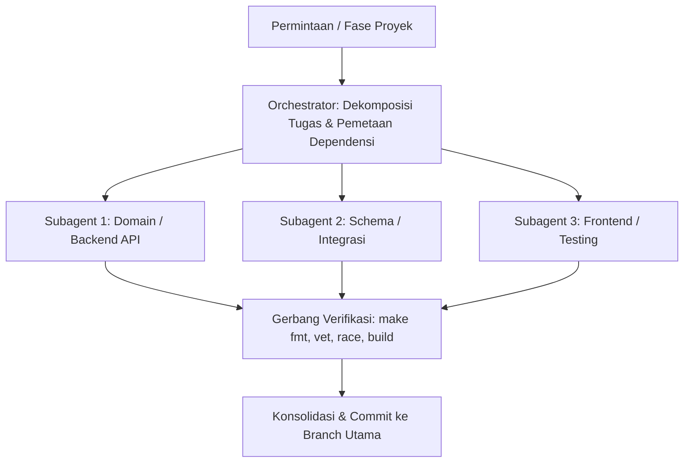

# Agent Orchestrator untuk Route-X

Keahlian ini memandu peran Agent Orchestrator dalam membagi tugas berskala besar, mendelegasikan pekerjaan ke subagent khusus secara konkuren, memantau kemajuan, dan menegakkan gerbang verifikasi kualitas.

---

## 1. Alur Orkestrasi Multi-Agent

### Prinsip Orkestrasi:
1. **Dekomposisi Tanpa Tumpang-Tindih**: Bagi tugas berdasarkan batas paket atau domain yang jelas (misal: subagent backend terpisah dari subagent endpoint testing atau webhooks).
2. **Isolasi Workspace**: Saat subagent perlu memodifikasi banyak berkas secara bersamaan, gunakan mode workspace `share` atau `branch` pada `invoke_subagent` untuk mencegah benturan file.
3. **Gerbang Kualitas Wajib**: Setiap subagent wajib memastikan pekerjaannya lolos:
   - `make fmt` (gofmt bersih)
   - `make vet` (analisis statis)
   - `go test -race` (bebas data race)
   - `make build` (biner `./ai-gateway` terkompilasi)
4. **Bahasa & Dokumentasi**: Seluruh komentar penjelasan dalam bahasa Indonesia, nama identifier dan commit message dalam bahasa Inggris.

---

## 2. Pemanfaatan MCP Server

Orchestrator didukung oleh MCP server yang aktif di lingkungan:
- **`postgres`**: Memeriksa skema tabel riil, constraints, dan partisi langsung pada PostgreSQL `routex`.
- **`sequential-thinking`**: Melakukan penalaran bertahap untuk pemecahan masalah rumit, penjadwalan dependensi, dan mitigasi risiko edge case.
- **`memory`**: Menyimpan fakta arsitektur dan status fase agar konteks tetap terjaga secara persisten.

---

## 3. Checklist Eksekusi Fase Berikutnya (Fase 11: Admin REST API)
- [ ] Buat handler REST API admin per domain (`upstream`, `gateway`, `automation`, `system`, `requests`).
- [ ] Pasang otorisasi peran RBAC (`requireRole` Super Admin / Admin / Operator / Viewer).
- [ ] Pasang pencatatan audit log untuk setiap mutasi (Create, Update, Delete).
- [ ] Lakukan integrasi ke router di `cmd/ai-gateway/main.go`.
- [ ] Verifikasi dengan `go test -race ./...` dan pengujian biner nyata.
