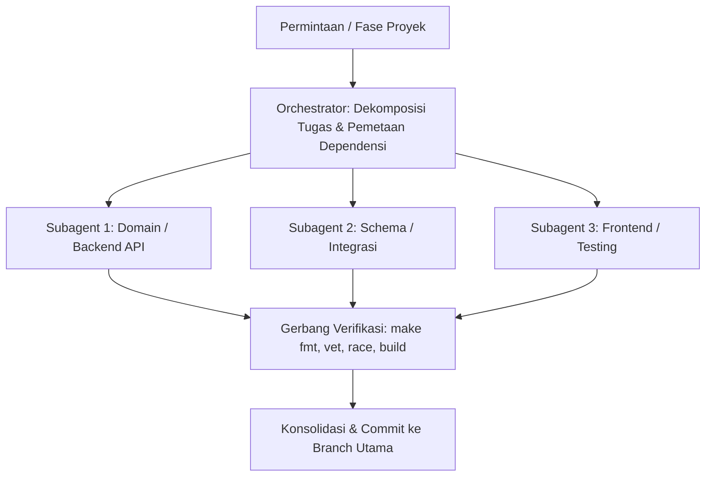

# Agent Orchestrator untuk Route-X

Keahlian ini memandu peran Agent Orchestrator dalam membagi tugas berskala besar, mendelegasikan pekerjaan ke subagent khusus secara konkuren, memantau kemajuan, dan menegakkan gerbang verifikasi kualitas.

---

## 1. Alur Orkestrasi Multi-Agent

### Prinsip Orkestrasi:
1. **Dekomposisi Tanpa Tumpang-Tindih**: Bagi tugas berdasarkan batas paket atau domain yang jelas (misal: subagent backend terpisah dari subagent endpoint testing atau webhooks).
2. **Isolasi Scope**: Beri setiap subagent daftar file atau paket yang tidak tumpang-tindih. Jalankan paralel hanya jika tidak ada dependensi hasil dan tidak ada target file yang sama.
3. **Gerbang Kualitas Wajib**: Setiap subagent wajib memastikan pekerjaannya lolos:
   - `make fmt` (gofmt bersih)
   - `make vet` (analisis statis)
   - `make test-unit` untuk gate cepat tanpa dependency eksternal
   - `make race` saat `DATABASE_URL` tersedia dan perubahan menyentuh konkurensi/integrasi
   - `make build` (biner `./ai-gateway` terkompilasi)
4. **Bahasa & Dokumentasi**: Seluruh komentar penjelasan dalam bahasa Indonesia, nama identifier dan commit message dalam bahasa Inggris.

---

## 2. Pemanfaatan MCP Server

Orchestrator didukung oleh MCP server yang aktif di lingkungan:
- **`postgres`**: Memeriksa skema tabel riil, constraints, indeks, dan query plan PostgreSQL `routex` secara read-only.
- **`playwright`**: Menguji alur UI dan aksesibilitas browser secara headless.
- **`sequential-thinking`**: Melakukan penalaran bertahap untuk pemecahan masalah rumit, penjadwalan dependensi, dan mitigasi risiko edge case.

MCP bukan pengganti pembacaan source dan test. Jangan gunakan PostgreSQL MCP untuk mutasi data atau migrasi.

---

## 3. Pemetaan Subagent OpenCode

- **`route-x-backend`**: Go, Chi, pgx, Redis, workers, routing engine, dan API.
- **`route-x-frontend`**: React, TypeScript, TanStack Query, Tailwind, accessibility, dan Playwright.
- **`route-x-data-security`**: PostgreSQL, migrasi, auth, RBAC, crypto, SSRF, dan audit log.
- **`route-x-reviewer`**: Review akhir read-only berbasis diff.

Setiap delegasi wajib memuat tujuan, scope file, acceptance criteria, perintah verifikasi, dan format hasil. Orchestrator tetap bertanggung jawab mengintegrasikan hasil dan menjalankan gate akhir.
