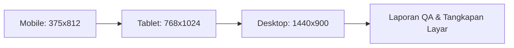

# QA Engineering & Verification Runbook (Route-X)

Keahlian ini mengatur protokol pengujian antarmuka (UI/UX), audit visual multi-viewport, verifikasi aksesibilitas, dan uji integritas sistem Route-X Enterprise AI Gateway.

---

## 1. Matriks Pengujian Multi-Viewport (Puppeteer)

Setiap pengujian antarmuka wajib menguji minimal 3 ukuran layar menggunakan Puppeteer MCP:



### Prosedur Pengujian Viewport:
1. **Navigasi & Set Viewport**:
   ```json
   {
     "url": "http://localhost:8080/#/nama-halaman",
     "width": 375,
     "height": 812
   }
   ```
2. **Jeda Transisi CSS**:
   - Beri jeda minimal 300ms setelah resize agar animasi drawer (`transition-all duration-300`) selesai sebelum mengambil tangkapan layar.
3. **Pemeriksaan Overflow & Clipping**:
   - Pastikan `document.documentElement.scrollWidth <= window.innerWidth` (tidak ada scrollbar horizontal liar di ponsel).
   - Pastikan teks judul dan badge angka tidak saling bertabrakan atau terpotong tanpa `text-overflow: ellipsis`.
   - Gunakan strategi **dual-rendering** untuk data padat: tabel pada desktop (`sm:block`), kartu vertikal pada mobile (`sm:hidden`).

---

## 2. Standar Kualitas UI/UX Route-X

### A. Penanganan Kondisi Kosong (*Empty State*)
Setiap halaman daftar data (`Requests`, `APIKeys`, `Budgets`, `RateLimits`, dll.) wajib menangani kondisi saat database masih bersih (0 rekaman):
1. **Dilarang Layar Kosong/Blank**: Harus ada kartu terdedikasi di tengah area konten.
2. **Ikon Tematik**: Lingkaran latar gelap dengan ikon representatif (misal: `Coins` untuk anggaran, `KeyRound` untuk API Keys, `Gauge` untuk rate limits, `Activity` untuk logs).
3. **Pesan Edukatif**: Judul dan penjelasan dalam bahasa Indonesia yang menjelaskan fungsi fitur.
4. **Call to Action (CTA)**: Tombol utama beraksen lime (`bg-accent text-black font-bold`) yang langsung membuka modal pembuatan data.

### B. Larangan Mutlak Dialog Browser Native
- **0 Dialog Native**: Dilarang menggunakan `window.alert()`, `window.confirm()`, atau `window.prompt()`.
- **Sistem Notifikasi**:
  - Umpan balik aksi (sukses, peringatan, error) wajib menggunakan `useToast()` dari `ToastContext`.
  - Konfirmasi tindakan destruktif (hapus data, cabut kunci, rotasi token) wajib menggunakan modal konfirmasi interaktif `confirmModal({ title, message, danger: true })`.

### C. Data Riil & Tanpa Mock/Stub
- Data sistem harus berasal langsung dari telemetri kernel Linux (`/proc/meminfo`, `/proc/net/dev`), PostgreSQL pool, Redis cache, dan proxy pool Xray riil.
- Nilai uang wajib diproses dalam skala integer 8 desimal (`upstream.USD` / 1e-8 USD).

---

## 3. Alur Otomasi Audit Menu

Saat melakukan audit QA pada seluruh menu:
1. Buka setiap rute hash satu per satu (`/#/`, `/#/requests`, `/#/observability`, `/#/upstreams/providers`, `/#/upstreams/models`, `/#/upstreams/egress`, `/#/gateway/routing`, `/#/gateway/rate-limits`, `/#/gateway/budgets`, `/#/access/api-keys`, `/#/cli-integrations`, `/#/system/settings`, `/#/system/diagnostics`).
2. Tangkap tangkapan layar di mode Mobile dan Desktop.
3. Simpan artefak audit ke direktori artifact.
4. Uji interaksi modal (buka, isi input, batalkan, simpan).
5. Jalankan 4 gerbang verifikasi teknis sebelum tugas selesai:
   ```bash
   make fmt
   make vet
   go test -race -short ./...
   make build
   ```
