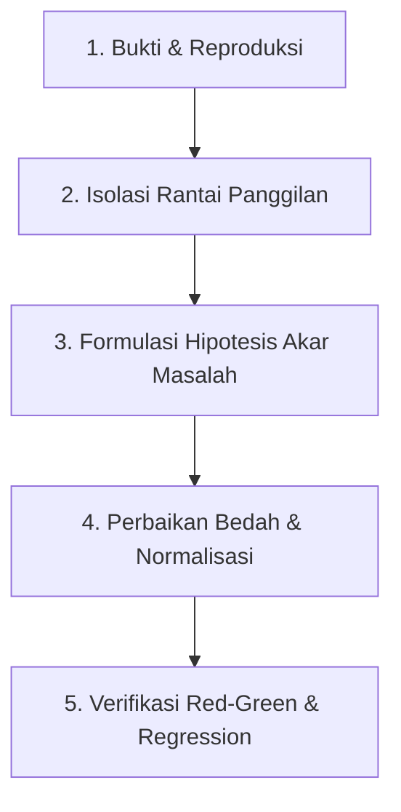

# Systematic Debugging Runbook (Route-X)

Keahlian ini memandu proses diagnosa dan perbaikan bug secara terstruktur, presisi, dan berbasis bukti nyata. Setiap masalah teknis harus ditangani hingga ke akar penyebabnya (*root cause*), bukan sekadar menambal gejala di permukaan (*symptom masking*).

---

## 1. Alur 5 Tahap Investigasi & Perbaikan



### Tahap 1: Pengumpulan Bukti & Reproduksi Nyata
1. **Periksa Log Container Terkini**:
   ```bash
   docker logs routex-gateway --tail 100
   ```
2. **Identifikasi Pesan Error Spesifik**:
   - Cari baris dengan level `level=WARN` atau `level=ERROR`.
   - Periksa field `error`, `request_id`, `resource`, dan `path`.
   - Contoh: Jika ada error `nilai melanggar aturan tabel (constraint providers_kind_valid)`, langsung catat nama constraint database terkait.
3. **Reproduksi Masalah**:
   - Lakukan reproduksi dengan perintah `curl`, skrip interaktif, atau navigasi Puppeteer Headless.
   - Pastikan request mereplikasi input pengguna secara persis.

### Tahap 2: Isolasi Rantai Panggilan (Traceroute Kode)
1. **Cari Titik Sumber Error**:
   - Gunakan `grep_search` atau `search_graph` pada nama fungsi atau pesan error.
   - Telusuri alur: `Handler HTTP` (`internal/admin/`) -> `Business Logic / Adapter` (`internal/providers/`) -> `Repository Database` (`internal/database/repo/`).
2. **Inspeksi Integritas Schema & Tipe Data**:
   - Jika melibatkan database, periksa berkas migrasi di `internal/database/migrations/` dan query tabel di container:
     ```bash
     docker exec -i routex-postgres psql -U routex -d routex -c "\d nama_tabel"
     ```
   - Bandingkan tipe data antara TypeScript frontend, DTO Go, dan constraint PostgreSQL (contoh: hyphen `-` vs underscore `_`, format string regex).

### Tahap 3: Formulasi Hipotesis Akar Masalah
- **Pertanyaan Kunci**: Mengapa kegagalan ini bisa terjadi? Apakah ada asumsi format input yang berbeda antara frontend dan backend? Apakah penanganan error terlalu generik sehingga membingungkan pengguna?
- Hindari menyimpulkan sebelum ada bukti log atau pengujian yang mengonfirmasi hipotesis.

### Tahap 4: Perbaikan Bedah (Surgical Fix)
Prinsip perbaikan di Route-X:
1. **Toleransi Input (Postel's Law)**:
   - Terima variasi input yang masuk akal di backend (contoh: otomatis normalisasi `"openai-compatible"` menjadi `"openai_compatible"`).
   - Sanitasi otomatis di frontend saat pengguna mengetik (contoh: otomatis slugify spasi menjadi `-` dan lowercase untuk identifier).
2. **Pesan Error Informatif**:
   - Uraikan error database/sistem ke pesan bahasa Indonesia yang ramah pengguna menggunakan `repo.ConstraintName(err)` agar pengguna tahu persis apa yang perlu diperbaiki.
3. **Presisi Keuangan**:
   - Selalu gunakan `upstream.USD` (integer skala 8 desimal) untuk nilai finansial, jangan pernah memakai `float64`.
4. **Komentar Kode**:
   - Tuliskan alasan teknis (*why*) dan dampak jika keputusan diubah dalam bahasa Indonesia.

### Tahap 5: Verifikasi Red-Green & Regression Check
1. **Uji Kasus yang Sebelumnya Gagal**:
   - Kirim kembali payload yang menyebabkan error.
   - Pastikan request berhasil dieksekusi (status 200/201) dan data tersimpan dengan benar di database.
2. **Uji Kasus Valid Lainnya**:
   - Pastikan alur normal lainnya tidak terganggu.
3. **Jalankan 4 Gerbang Kualitas Wajib**:
   ```bash
   make fmt
   make vet
   go test -race -short ./...
   make build
   ```
4. **Deploy & Cek Status Produksi**:
   - Salin biner baru ke container `routex-gateway` dan restart:
     ```bash
     docker cp ai-gateway routex-gateway:/usr/local/bin/ai-gateway && docker restart routex-gateway
     curl -s http://localhost:8080/healthz
     ```

---

## 2. Pustaka Constraint & Kode Error Umum di Route-X

| Nama Constraint PostgreSQL | Kolom / Tabel | Format Wajib | Pesan Rekomendasi Bahasa Indonesia |
| :--- | :--- | :--- | :--- |
| `providers_name_format` | `name` / `providers` | `^[a-z0-9][a-z0-9_-]*$` | Format nama hanya boleh diawali huruf kecil/angka dan menggunakan huruf kecil, angka, `-`, atau `_` |
| `providers_kind_valid` | `kind` / `providers` | `'openai'`, `'anthropic'`, `'google'`, `'openai_compatible'`, `'custom'` | Jenis adaptor tidak valid. Gunakan dialek resmi yang didukung |
| `providers_base_url_scheme` | `base_url` / `providers` | `^https?://` | Base URL upstream wajib diawali dengan `http://` atau `https://` |
| `providers_priority_range` | `priority` / `providers` | `0` s/d `100000` | Nilai prioritas harus berada di antara 0 dan 100.000 |
| `providers_weight_positive` | `weight` / `providers` | `> 0` | Bobot provider harus lebih besar dari 0 |
| `providers_timeout_range` | `timeout_ms` / `providers`| `1000` s/d `900000` | Batas waktu timeout harus di antara 1.000 ms dan 900.000 ms |
| `models_canonical_slug_format` | `canonical_slug` / `models` | `^[a-z0-9][a-z0-9_.-]*$` | Format canonical slug model tidak sah |
