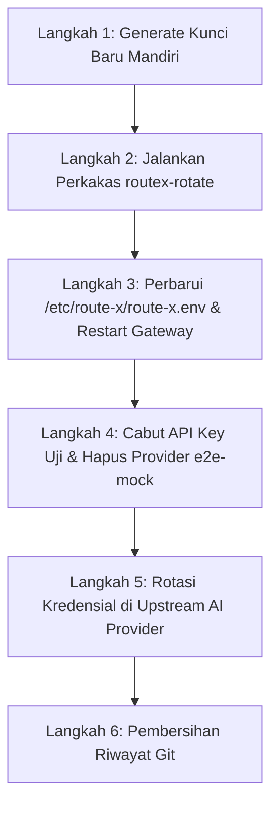

# Panduan Operasional: Prosedur Rotasi Kunci & Remediasi Keamanan Produksi

Dokumen ini ditujukan untuk **OPERATOR PRODUKSI** Route-X.  
Panduan ini merinci langkah demi langkah remediasi keamanan pasca-audit, urutan rotasi rahasia kriptografis, pembersihan data uji, dan penegasan arsitektur deploy produksi.

---

## 1. Latar Belakang & Prinsip Keamanan

Hasil audit membuktikan bahwa nilai bawaan `SESSION_SECRET`, `ENCRYPTION_KEY`, `API_KEY_PEPPER`, dan kata sandi admin awal sempat ter-commit ke repositori. Oleh karena itu:
1. Menghapus nilai dari commit HEAD **tidak memulihkan keamanan** rahasia yang sudah terekspos.
2. Seluruh rahasia wajib diganti di lingkungan produksi secara mandiri oleh operator.
3. Seluruh kredensial provider upstream (pihak ketiga) yang pernah dicoba atau ter-commit wajib dirotasi di dashboard masing-masing penyedia layanan.
4. Data di database yang dienkripsi dengan `ENCRYPTION_KEY` lama wajib dienkripsi ulang (*re-encrypted*) menggunakan perkakas `routex-rotate` sebelum konfigurasi gateway diperbarui.

---

## 2. Urutan Langkah Rotasi & Alasan Teknisnya

Urutan di bawah ini **WAJIB dipatuhi**. Melompat atau membalikkan urutan dapat menyebabkan gateway gagal membaca kredensial (*service outage*) atau menolak sesi pengguna.



### Langkah 1: Generate Kunci Kriptografis Baru secara Mandiri

Operator wajib membuat tiga kunci kriptografis baru dan satu kata sandi baru menggunakan generator acak kriptografis (`openssl` / CSPRNG). **Jangan pernah menggunakan nilai contoh atau string statis.**

Jalankan perintah berikut di mesin aman operator:

```bash
# 1. Kunci Sesi Web Admin (minimal 32 byte base64, disarankan 48 byte)
export NEW_SESSION_SECRET=$(openssl rand -base64 48)

# 2. Kunci Enkripsi Kredensial Provider (AES-256-GCM, WAJIB tepat 32 byte base64)
export NEW_ENCRYPTION_KEY=$(openssl rand -base64 32)

# 3. Kunci Pepper HMAC API Key (HMAC-SHA256, WAJIB tepat 32 byte base64)
export NEW_API_KEY_PEPPER=$(openssl rand -base64 32)

# 4. Kata Sandi Administrator Produksi (minimal 16 karakter acak)
export NEW_ADMIN_PASSWORD=$(openssl rand -base64 24)
```

Ambil kunci lama yang saat ini aktif di `/etc/route-x/route-x.env`:
```bash
export OLD_ENCRYPTION_KEY="<isi_dengan_nilai_ENCRYPTION_KEY_lama_dari_route-x.env>"
export DATABASE_URL="<isi_dengan_DATABASE_URL_produksi>"
```

---

### Langkah 2: Jalankan Perkakas Rotasi Database (`routex-rotate`)

*Alasan Urutan*:  
Tabel `provider_credentials` (kredensial upstream), `webhooks` (rahasia tanda tangan), dan `egress_pool` (URL proxy) menyimpan data yang dienkripsi menggunakan AES-256-GCM terikat `OLD_ENCRYPTION_KEY`.  
Jika gateway dimuat ulang dengan `NEW_ENCRYPTION_KEY` **sebelum** data di database dienkripsi ulang, seluruh pemanggilan inferensi AI ke upstream dan pengiriman webhook akan langsung **gagal** karena error `ErrKeyMismatch`.

#### 2.1 Jalankan Simulasi (Dry-Run)
Perkakas mendukung verifikasi tanpa penulisan ke database. Pada mode dry-run, perkakas membaca seluruh baris yang menggunakan kunci lama, menguji dekripsinya, dan memastikan integritas data tanpa mengubah apa pun:

```bash
./routex-rotate \
  --old-key="$OLD_ENCRYPTION_KEY" \
  --new-key="$NEW_ENCRYPTION_KEY" \
  --db-url="$DATABASE_URL" \
  --dry-run
```

Pastikan keluaran simulasi menampilkan:
- Jumlah baris terdeteksi per tabel.
- Tidak ada kegagalan dekripsi atau error AAD.

#### 2.2 Jalankan Eksekusi Nyata
Setelah mode simulasi sukses, jalankan eksekusi nyata:

```bash
./routex-rotate \
  --old-key="$OLD_ENCRYPTION_KEY" \
  --new-key="$NEW_ENCRYPTION_KEY" \
  --db-url="$DATABASE_URL"
```

*Jaminan Arsitektur:*
- **Isolasi Transaksi**: Pembaruan berjalan di dalam 1 transaksi per tabel. Jika terjadi error di tengah baris satu tabel, transaksi tabel tersebut dibatalkan secara bersih (*rollback*).
- **Atomisitas Ciphertext & Key ID**: Kolom `ciphertext` dan `encryption_key_id` selalu diperbarui bersamaan dalam 1 query `UPDATE`.
- **Pengikatan AAD**: AAD tetap terikat unik ke ID baris (`security.CredentialAAD(id)` / `security.WebhookAAD(id)`), mencegah celah serangan ciphertext swapping.
- **Idempoten**: Menjalankan perkakas ini berulang kali dengan parameter kunci yang sama aman dan tidak akan mengubah baris yang sudah dirotasi.

---

### Langkah 3: Perbarui Berkas Konfigurasi & Restart Gateway

*Alasan Urutan*:  
Setelah database siap dengan kunci baru, konfigurasi runtime gateway dapat diperbarui ke kunci baru.

1. Buka berkas `/etc/route-x/route-x.env` pada server:
   ```bash
   sudo nano /etc/route-x/route-x.env
   ```
2. Perbarui nilai:
   ```ini
   SESSION_SECRET=<masukkan $NEW_SESSION_SECRET>
   ENCRYPTION_KEY=<masukkan $NEW_ENCRYPTION_KEY>
   API_KEY_PEPPER=<masukkan $NEW_API_KEY_PEPPER>
   ```
3. Restart layanan gateway:
   ```bash
   sudo systemctl restart route-x
   sudo systemctl status route-x
   ```
   *Dampak Operasional*:
   - Pergantian `SESSION_SECRET` akan otomatis menganulir seluruh sesi login admin yang sedang aktif. Seluruh pengguna akan diminta login kembali (perilaku keamanan yang diharapkan).
   - Gateway langsung dapat mendekripsi kredensial di database karena data sudah dirotasi di Langkah 2.

---

### Langkah 4: Cabut API Key Uji & Hapus Provider Uji `e2e-mock-*`

*Alasan Urutan*:  
Selama proses verifikasi otomatis (CI/CD atau uji coba staging), entitas provider tiruan (`e2e-mock-*`) dan API key uji dapat tertinggal di basis data. Data ini mengotori dashboard analitik, metrik Prometheus, dan menimbulkan risiko keamanan bila API key uji tidak dicabut.

Jalankan skrip pembersihan berikut menggunakan koneksi database administratif atau psql:

```sql
-- 1. Hapus seluruh provider mock uji dan kredensial terkait (cascade)
DELETE FROM providers WHERE name LIKE 'e2e-mock-%' OR name LIKE 'test-prov-%';

-- 2. Cabut API key klien yang dibuat untuk keperluan pengujian
UPDATE client_api_keys 
SET revoked_at = now() 
WHERE name LIKE 'E2E Key%' OR name LIKE 'Test Key%' OR name LIKE 'e2e-%';

-- 3. Hapus webhook uji coba
DELETE FROM webhooks WHERE name LIKE 'test-%' OR url LIKE '%example.com%';
```

---

### Langkah 5: Rotasi Kunci Upstream di Layanan Pihak Ketiga

*Alasan Urutan*:  
Kunci API penyedia upstream (misalnya Anthropic, OpenAI, Google Gemini, OpenRouter) yang pernah tersimpan di repositori git publik atau digunakan dalam uji coba live **wajib dianggap telah terkompromi**.

Langkah operator:
1. Masuk ke portal masing-masing AI Provider (mis. [Anthropic Console](https://console.anthropic.com/), [OpenAI Platform](https://platform.openai.com/)).
2. Terbitkan API Key baru untuk Route-X.
3. Masuk ke Dashboard Admin Route-X (`/providers`), buat atau perbarui kredensial provider dengan API Key baru.
4. Lakukan verifikasi inferensi bahwa provider berfungsi normal.
5. **Hapus atau cabut (Revoke)** API Key lama di portal AI Provider.

---

### Langkah 6: Pembersihan Riwayat Git (Opsional / Repositori Publik)

Jika repositori pernah berstatus publik, commit terdahulu yang memuat rahasia tetap tersimpan di riwayat objek Git. Operator dapat membersihkan seluruh commit lawas dengan alat bantu seperti `git-filter-repo` atau BFG:

```bash
# Contoh menggunakan git-filter-repo untuk menghapus berkas rahasia dari riwayat
git-filter-repo --invert-paths --path remediator-secret.txt
```

---

## 3. PERINGATAN KRITIS: Sinkronisasi `APP_ENV=production` dan TLS (HTTPS)

> [!CAUTION]
> **JANGAN PERNAH menyetel `APP_ENV=production` pada layanan yang hanya diakses melalui protokol HTTP biasa.**

### Mengapa Ini Terjadi?
1. Saat `APP_ENV=production`, Route-X mengaktifkan pertahanan sesi tingkat tinggi sesuai spesifikasi RFC 6265bis:
   - Nama cookie sesi menggunakan prefix `__Host-routex_session`.
   - Cookie disetel dengan atribut: `Secure; HttpOnly; SameSite=Lax; Path=/`.
2. Menurut standar keamanan browser modern:
   - Prefix `__Host-` mewajibkan atribut `Secure` aktif.
   - Atribut `Secure` **melarang keras** browser menyimpan atau mengirimkan cookie melalui koneksi yang tidak terenkripsi (plain HTTP).
3. Jika Route-X berjalan dengan `APP_ENV=production` di balik HTTP biasa tanpa TLS (atau jika reverse proxy tidak meneruskan header `X-Forwarded-Proto: https`):
   - Server merespons login sukses (HTTP 200) dengan header `Set-Cookie: __Host-routex_session=...; Secure`.
   - Browser **menolak secara diam-diam** (*silently discards*) cookie tersebut karena koneksi bukan HTTPS.
   - Pada permintaan berikutnya, browser tidak mengirim cookie sesi, sehingga pengguna **stuck** di halaman login tanpa pesan kesalahan yang jelas.

### Solusi Wajib:
- Pasang reverse proxy Caddy (tersedia di `docker-compose.prod.yml` atau `deploy/caddy/Caddyfile`) yang secara otomatis mengelola sertifikat TLS Let's Encrypt / ZeroSSL.
- Pastikan variabel `PUBLIC_URL` pada konfigurasi produksi disetel dengan skema `https://`, misalnya:
  ```ini
  PUBLIC_URL=https://gateway.domainanda.com
  ```
- Seluruh lalu lintas port 80 secara otomatis dialihkan (301 redirect) ke 443 HTTPS oleh Caddy.
